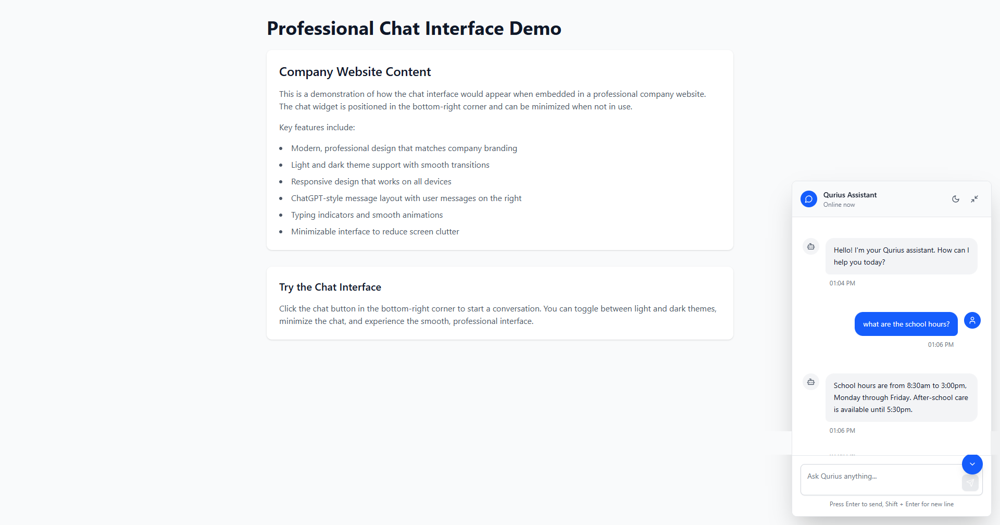
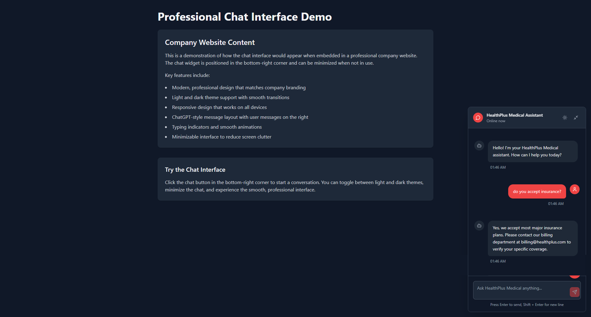

# 🚀 Qurius-AI: Multi-Company FAQ Assistant

> **Intelligent FAQ Management System with AI-Powered Semantic Search**

[](https://reactjs.org/)
[](https://www.typescriptlang.org/)
[](https://vitejs.dev/)
[](https://supabase.com/)
[](https://tailwindcss.com/)

## 📋 Table of Contents

- [Overview](#overview)
- [Features](#features)
- [Tech Stack](#tech-stack)
- [Architecture](#architecture)
- [Screenshots](#screenshots)
- [Getting Started](#getting-started)
- [Usage](#usage)
- [API Documentation](#api-documentation)
- [Contributing](#contributing)

## 🎯 Overview

Qurius-AI is a sophisticated multi-company FAQ management system that leverages AI-powered semantic search to provide instant, accurate answers to user queries. Built with modern web technologies, it offers a seamless experience for both companies managing their knowledge base and users seeking information.

### Key Highlights

- **🤖 AI-Powered Semantic Search**: Uses Jina embeddings for intelligent question matching
- **🏢 Multi-Company Support**: Scalable architecture supporting multiple organizations
- **⚡ Real-Time Responses**: Instant FAQ retrieval with confidence scoring
- **🎨 Modern UI/UX**: Beautiful, responsive interface with dark/light themes
- **🔒 Secure & Scalable**: Built with Supabase for enterprise-grade security

## ✨ Features

### Core Functionality
- **Semantic FAQ Search**: AI-powered question matching using vector embeddings
- **Multi-Company Architecture**: Support for multiple organizations with isolated data
- **Confidence Scoring**: Intelligent ranking of FAQ matches
- **AI Fallback**: Seamless transition to AI responses when FAQs don't match
- **Bulk Import**: Efficient FAQ management with JSON import capabilities

### User Experience
- **Responsive Design**: Works perfectly on desktop, tablet, and mobile
- **Theme Support**: Light and dark mode with smooth transitions
- **Real-Time Chat**: Live typing indicators and streaming responses
- **Minimizable Interface**: Non-intrusive chat widget for websites
- **Accessibility**: WCAG compliant with keyboard navigation

### Developer Experience
- **TypeScript**: Full type safety across the entire application
- **Modern Stack**: React 18, Vite, Tailwind CSS
- **Comprehensive Testing**: Isolated function testing capabilities
- **Clean Architecture**: Well-structured, maintainable codebase

## 🛠 Tech Stack

### Frontend
   

- **React 18**: Latest React features with hooks and concurrent rendering
- **TypeScript**: Full type safety and enhanced developer experience
- **Vite**: Lightning-fast build tool and development server
- **Tailwind CSS**: Utility-first CSS framework for rapid UI development

### Backend & Database
  

- **Supabase**: Backend-as-a-Service with real-time capabilities
- **PostgreSQL**: Robust relational database with advanced features
- **pgvector**: Vector similarity search for semantic matching
- **Row Level Security**: Enterprise-grade data protection

### AI & Machine Learning
 

- **Jina Embeddings**: High-quality text embeddings for semantic search
- **OpenRouter**: Access to multiple AI models for fallback responses
- **Vector Similarity**: Advanced similarity algorithms for accurate matching

### Development Tools
  

- **ESLint**: Code quality and consistency
- **Prettier**: Automatic code formatting
- **Git**: Version control with comprehensive .gitignore

## 🏗 Architecture

```
┌─────────────────┐    ┌─────────────────┐    ┌─────────────────┐
│   Frontend      │    │   Backend       │    │   AI Services   │
│                 │    │                 │    │                 │
│ • React 18      │◄──►│ • Supabase      │◄──►│ • Jina AI       │
│ • TypeScript    │    │ • PostgreSQL    │    │ • OpenRouter    │
│ • Tailwind CSS  │    │ • pgvector      │    │ • Embeddings    │
│ • Vite          │    │ • RLS Security  │    │ • Semantic      │
└─────────────────┘    └─────────────────┘    └─────────────────┘
```

### Data Flow

1. **User Query**: User asks a question through the chat interface
2. **Embedding Generation**: Question is converted to vector embeddings using Jina AI
3. **Semantic Search**: Vector similarity search finds relevant FAQs in PostgreSQL
4. **Confidence Scoring**: AI evaluates match quality and confidence
5. **Response**: Returns FAQ answer or falls back to AI-generated response

## 📸 Screenshots

<div style="display: grid; grid-template-columns: 1fr 1fr; gap: 20px; margin: 20px 0;">
  <div style="border-radius: 8px; padding: 20px; text-align: center; background: #f9f9f9;">
    <h3 style="margin: 0 0 10px 0; color: #333;">Light Mode Interface</h3>
    <p style="margin: 0; color: #666; font-size: 14px;">Clean, modern design with light theme</p>
    <div style="margin-top: 15px;">
      
    </div>
  </div>
  
  <div style="border-radius: 8px; padding: 20px; text-align: center; background: #f9f9f9;">
    <h3 style="margin: 0 0 10px 0; color: #333;">Dark Mode Interface</h3>
    <p style="margin: 0; color: #666; font-size: 14px;">Sleek dark theme for better user experience</p>
    <div style="margin-top: 15px;">
      
    </div>
  </div>
</div>

### Key Features Showcased

- **Modern Chat Interface**: Clean, professional design with real-time responses
- **Responsive Design**: Works seamlessly across all devices
- **Theme Support**: Dark and light mode with smooth transitions
- **Admin Controls**: Comprehensive FAQ and company management
- **Analytics Dashboard**: Insights and usage tracking

## 🚀 Getting Started

### Prerequisites

- Node.js 18+ 
- npm or yarn
- Supabase account
- Jina AI API key
- OpenRouter API key

### Installation

1. **Clone the repository**
   ```bash
   git clone https://github.com/yourusername/qurius-ai.git
   cd qurius-ai
   ```

2. **Install dependencies**
   ```bash
   npm install
   ```

3. **Set up environment variables**
   ```bash
   cp .env.example .env
   ```
   
   Configure your `.env` file:
   ```env
   VITE_SUPABASE_PROJECT_URL=your_supabase_url
   VITE_SUPABASE_ANON_KEY=your_supabase_anon_key
   VITE_SUPABASE_SERVICE_ROLE_KEY=your_supabase_service_role_key
   VITE_JINA_API_KEY=your_jina_api_key
   VITE_OPEN_ROUTER_API_KEY=your_openrouter_api_key
   ```

4. **Set up database**
   ```sql
   -- Run the SQL commands from queries.sql in your Supabase SQL editor
   ```

5. **Start development server**
   ```bash
   npm run dev
   ```

6. **Import sample FAQs**
   ```bash
   npx tsx scripts/importFaqs.ts
   ```

## 📖 Usage

### For Companies

1. **Add Your Company**: The system automatically creates company records
2. **Import FAQs**: Use the bulk import feature with JSON files
3. **Customize**: Configure themes, branding, and response thresholds
4. **Monitor**: Track usage analytics and user satisfaction

### For Developers

1. **Extend Functionality**: Add custom FAQ categories and tags
2. **Integrate APIs**: Connect with existing knowledge bases
3. **Customize UI**: Modify themes and components as needed
4. **Scale**: Deploy to production with confidence

### API Examples

```typescript
// Search FAQs
const results = await FAQService.searchFAQs(
  "What are your business hours?", 
  "Acme Corporation"
);

// Add new FAQ
const newFAQ = await FAQService.addFAQ({
  company: "Acme Corporation",
  question: "How do I contact support?",
  answer: "You can reach us at support@acme.com"
});
```

## 📚 API Documentation

### FAQService Class

#### `searchFAQs(userQuestion: string, companyName: string)`
Searches for relevant FAQs using semantic similarity.

#### `addFAQ(faq: FAQWithCompany)`
Adds a new FAQ with automatic embedding generation.

#### `getAnswer(userQuestion: string, confidenceThreshold?: number)`
Gets the best answer, falling back to AI if no FAQ matches.

#### `getOrCreateCompanyId(companyName: string)`
Manages company records automatically.

## 🤝 Contributing

We welcome contributions! Please see our [Contributing Guidelines](CONTRIBUTING.md) for details.

### Development Setup

1. Fork the repository
2. Create a feature branch
3. Make your changes
4. Add tests if applicable
5. Submit a pull request

## 📄 License

This project is licensed under the MIT License - see the [LICENSE](LICENSE) file for details.

## 🙏 Acknowledgments

- [Supabase](https://supabase.com/) for the excellent backend platform
- [Jina AI](https://jina.ai/) for powerful embedding capabilities
- [OpenRouter](https://openrouter.ai/) for AI model access
- [Tailwind CSS](https://tailwindcss.com/) for the beautiful UI framework

---

**Built using modern web technologies (Vite + React, Typescript & Supabase)**

*For questions or support, please open an issue or contact the development team.*
