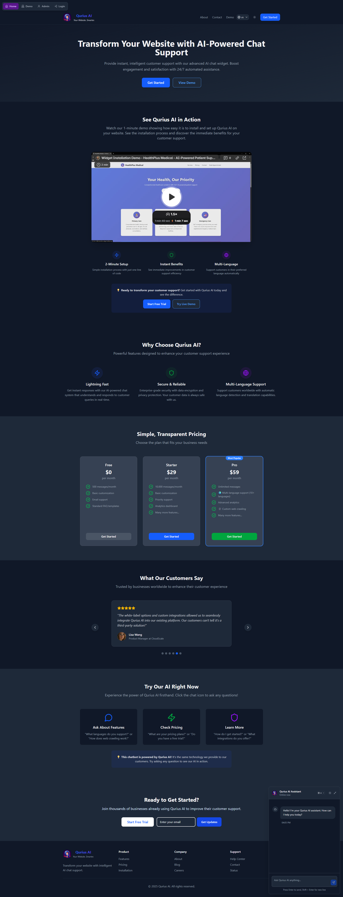

# 🚀 Qurius AI: AI Website Assistant for SaaS

> **AI website assistant for SaaS products – answer up to 85% of customer questions automatically, reduce support tickets and convert leads.**

[](https://reactjs.org/)
[](https://www.typescriptlang.org/)
[](https://vitejs.dev/)
[](https://supabase.com/)
[](https://tailwindcss.com/)

## 📋 Table of Contents

- [Overview](#overview)
- [Project Progress](#project-progress)
- [Features](#features)
- [Tech Stack](#tech-stack)
- [Architecture](#architecture)
- [Screenshots](#screenshots)
- [Getting Started](#getting-started)
- [Usage](#usage)
- [API Documentation](#api-documentation)
- [Contributing](#contributing)

## 🎯 Overview

Qurius AI is an AI-powered website assistant designed for SaaS companies. It connects to your docs, help center, and product pages to provide instant, accurate answers to user questions, deflect repetitive support tickets, and guide new users through your product. Built with modern web technologies, it offers a seamless experience for both teams managing their knowledge base and SaaS users seeking in‑product help.

### Key Highlights

- **🤖 AI-Powered Semantic Search**: Uses Jina embeddings for intelligent question matching across your SaaS docs and FAQs
- **🏢 Multi-Tenant SaaS Support**: Scalable architecture supporting multiple products or workspaces
- **⚡ Real-Time Responses**: Instant AI answers with confidence scoring
- **🎨 Modern UI/UX**: Beautiful, responsive assistant interface with dark/light themes
- **🔒 Secure & Scalable**: Built with Supabase for SaaS-grade security and multi-tenant isolation

## 📈 Project Progress

### 🎯 **Core Development Milestones**

#### **Phase 1: Foundation & Architecture** ✅
- **✅ Multi-Company Database Design**: Implemented scalable PostgreSQL schema with Row Level Security
- **✅ Authentication System**: Integrated Supabase Auth with role-based access control
- **✅ Vector Embeddings**: Set up pgvector for semantic similarity search
- **✅ API Architecture**: RESTful endpoints with proper error handling and rate limiting

#### **Phase 2: Frontend Development** ✅
- **✅ React 18 + TypeScript**: Modern component architecture with full type safety
- **✅ Responsive AI Assistant Interface**: Minimizable, theme-aware assistant embedded in your SaaS app or marketing site
- **✅ Real-Time Features**: Typing indicators, streaming responses, auto-scroll
- **✅ Admin Dashboard**: Comprehensive analytics and FAQ/knowledge management interface

#### **Phase 3: AI Integration** ✅
- **✅ Semantic Search**: Jina AI embeddings for intelligent FAQ matching
- **✅ AI Fallback System**: Seamless transition to OpenRouter when FAQs don't match
- **✅ Confidence Scoring**: Dynamic threshold-based response quality assessment
- **✅ Multi-Language Support**: Translation services for global accessibility

#### **Phase 4: Analytics & Optimization** ✅
- **✅ Real-Time Analytics**: Comprehensive tracking of user interactions
- **✅ Performance Optimization**: Efficient database queries and caching
- **✅ Error Handling**: Robust error recovery and user feedback
- **✅ Rate Limiting**: Protection against abuse with configurable limits

#### **Phase 5: Production Features** ✅
- **✅ Email Integration**: Welcome emails via Resend, password resets via Supabase
- **✅ Domain Management**: Custom domain setup with DNS configuration
- **✅ Payment Integration**: Stripe subscription management (test bypass available)
- **✅ Deployment Ready**: Vercel deployment with environment configuration

### 🔧 **Technical Achievements**

#### **Database & Backend**
- **📊 Advanced Analytics**: SQL functions for real-time metrics calculation
- **🔐 Security**: Row Level Security policies for data isolation
- **⚡ Performance**: Optimized indexes and query patterns
- **🔄 Real-Time**: WebSocket integration for live updates

#### **Frontend Excellence**
- **🎨 Theme System**: Dynamic theming with company branding
- **📱 Responsive Design**: Mobile-first approach with touch optimization
- **♿ Accessibility**: WCAG 2.1 AA compliance
- **🌍 Internationalization**: Multi-language support with context-aware translations

#### **AI & Machine Learning**
- **🧠 Semantic Understanding**: Advanced vector similarity algorithms
- **🎯 Confidence Scoring**: Intelligent response quality assessment
- **🔄 Fallback Logic**: Graceful degradation to AI when FAQs don't match
- **📈 Learning System**: Continuous improvement through user feedback

### 🚀 **Production Readiness**

#### **Scalability Features**
- **🏢 Multi-Tenant Architecture**: Isolated data per company
- **📈 Horizontal Scaling**: Stateless API design
- **💾 Database Optimization**: Efficient query patterns and indexing
- **🔄 Caching Strategy**: Redis-ready architecture

#### **Security Implementation**
- **🔐 Authentication**: JWT-based secure authentication
- **🛡️ Authorization**: Role-based access control
- **🔒 Data Protection**: Encrypted data transmission
- **📊 Audit Logging**: Comprehensive activity tracking

#### **Monitoring & Analytics**
- **📊 Real-Time Metrics**: User engagement and satisfaction tracking
- **🔍 Error Monitoring**: Comprehensive error logging and alerting
- **📈 Performance Metrics**: Response time and throughput monitoring
- **👥 User Analytics**: Behavior tracking and insights

## ✨ Features

### Core Functionality
- **🔍 Semantic FAQ & Docs Search**: AI-powered question matching using vector embeddings
- **🏢 Multi-Tenant Architecture**: Support for multiple SaaS products/companies with isolated data
- **🎯 Confidence Scoring**: Intelligent ranking of matches from your docs, FAQs, and content
- **🤖 AI Fallback**: Seamless transition to AI-generated responses when FAQs don't match
- **📥 Bulk Import**: Efficient FAQ and knowledge management with JSON import capabilities

### User Experience
- **📱 Responsive Design**: Works perfectly on desktop, tablet, and mobile
- **🌙 Theme Support**: Light and dark mode with smooth transitions
- **💬 Real-Time Chat**: Live typing indicators and streaming responses
- **🔽 Minimizable Interface**: Non-intrusive chat widget for websites
- **♿ Accessibility**: WCAG compliant with keyboard navigation

### Developer Experience
- **🔧 TypeScript**: Full type safety across the entire application
- **⚡ Modern Stack**: React 18, Vite, Tailwind CSS
- **🧪 Comprehensive Testing**: Isolated function testing capabilities
- **🏗️ Clean Architecture**: Well-structured, maintainable codebase

## 🛠 Tech Stack

### Frontend
   

- **⚛️ React 18**: Latest React features with hooks and concurrent rendering
- **🔷 TypeScript**: Full type safety and enhanced developer experience
- **⚡ Vite**: Lightning-fast build tool and development server
- **🎨 Tailwind CSS**: Utility-first CSS framework for rapid UI development

### Backend & Database
  

- **🗄️ Supabase**: Backend-as-a-Service with real-time capabilities
- **🐘 PostgreSQL**: Robust relational database with advanced features
- **🔍 pgvector**: Vector similarity search for semantic matching
- **🔐 Row Level Security**: Enterprise-grade data protection

### AI & Machine Learning
 

- **🧠 Jina Embeddings**: High-quality text embeddings for semantic search
- **🤖 OpenRouter**: Access to multiple AI models for fallback responses
- **📊 Vector Similarity**: Advanced similarity algorithms for accurate matching

### Development Tools
  

- **🔍 ESLint**: Code quality and consistency
- **✨ Prettier**: Automatic code formatting
- **📝 Git**: Version control with comprehensive .gitignore

### Email & Communication
 

- **📧 Resend**: Transactional email service for welcome emails
- **💳 Stripe**: Payment processing and subscription management

## 🏗 Architecture

```
┌─────────────────┐    ┌─────────────────┐    ┌─────────────────┐
│   Frontend      │    │   Backend       │    │   AI Services   │
│                 │    │                 │    │                 │
│ ⚛️ React 18      │◄──►│ 🗄️ Supabase    │◄──►│ 🧠 Jina AI       │
│ 🔷 TypeScript   │    │ 🐘 PostgreSQL   │    │ 🤖 OpenRouter   │
│ 🎨 Tailwind CSS │    │ 🔍 pgvector     │    │ 📊 Embeddings   │
│ ⚡ Vite          │    │ 🔐 RLS Security │    │ 🎯 Semantic     │
└─────────────────┘    └─────────────────┘    └─────────────────┘
```

### Data Flow

1. **💬 User Query**: User asks a question through the chat interface
2. **🧠 Embedding Generation**: Question is converted to vector embeddings using Jina AI
3. **🔍 Semantic Search**: Vector similarity search finds relevant FAQs in PostgreSQL
4. **🎯 Confidence Scoring**: AI evaluates match quality and confidence
5. **💡 Response**: Returns FAQ answer or falls back to AI-generated response

## 📸 Screenshots

<div style="display: grid; grid-template-columns: 1fr 1fr; gap: 20px; margin: 20px 0;">
  <div style="border-radius: 8px; padding: 20px; text-align: center; background: #f9f9f9;">
    <h3 style="margin: 0 0 10px 0; color: #333;">Demo Page</h3>
    <p style="margin: 0; color: #666; font-size: 14px;">Clean, modern design with light and dark themes</p>
    <div style="margin-top: 15px;">
      
    </div>
  </div>

<div style="display: grid; grid-template-columns: 1fr 1fr; gap: 20px; margin: 20px 0;">
  <div style="border-radius: 8px; padding: 20px; text-align: center; background: #f9f9f9;">
    <h3 style="margin: 0 0 10px 0; color: #333;">📊 Admin Dashboard</h3>
    <p style="margin: 0; color: #666; font-size: 14px;">Comprehensive analytics and company management</p>
    <div style="margin-top: 15px;">
      
    </div>
  </div>
  
  <div style="border-radius: 8px; padding: 20px; text-align: center; background: #f9f9f9;">
    <h3 style="margin: 0 0 10px 0; color: #333;">🏠 Home </h3>
    <p style="margin: 0; color: #666; font-size: 14px;">Landing Page for Qurius AI</p>
    <div style="margin-top: 15px;">
      
    </div>
  </div>
</div>

### Key Features Showcased

- **💬 Modern Chat Interface**: Clean, professional design with real-time responses
- **📱 Responsive Design**: Works seamlessly across all devices
- **🌙 Theme Support**: Dark and light mode with smooth transitions
- **📊 Admin Controls**: Comprehensive FAQ and company management
- **📈 Analytics Dashboard**: Insights and usage tracking
- **🔧 FAQ Management**: Bulk import and intelligent organization

## 🚀 Getting Started

### Prerequisites

- Node.js 18+ 
- npm or yarn
- Supabase account
- Jina AI API key
- OpenRouter API key

### Installation

1. **📥 Clone the repository**
   ```bash
   git clone https://github.com/yourusername/qurius-ai.git
   cd qurius-ai
   ```

2. **📦 Install dependencies**
   ```bash
   npm install
   ```

3. **⚙️ Set up environment variables**
   ```bash
   cp .env.example .env
   ```
   
   Configure your `.env` file:
   ```env
   VITE_SUPABASE_PROJECT_URL=your_supabase_url
   VITE_SUPABASE_ANON_KEY=your_supabase_anon_key
   VITE_SUPABASE_SERVICE_ROLE_KEY=your_supabase_service_role_key
   VITE_JINA_API_KEY=your_jina_api_key
   VITE_OPEN_ROUTER_API_KEY=your_openrouter_api_key
   ```

4. **🗄️ Set up database**
   ```sql
   -- Run the SQL commands from queries.sql in your Supabase SQL editor
   ```

5. **🚀 Start development server**
   ```bash
   npm run dev
   ```

6. **📥 Import sample FAQs**
   ```bash
   npx tsx scripts/importFaqs.ts
   ```

## 📖 Usage

### For Companies

1. **🏢 Add Your Company**: The system automatically creates company records
2. **📥 Import FAQs**: Use the bulk import feature with JSON files
3. **🎨 Customize**: Configure themes, branding, and response thresholds
4. **📊 Monitor**: Track usage analytics and user satisfaction

### For Developers

1. **🔧 Extend Functionality**: Add custom FAQ categories and tags
2. **🔌 Integrate APIs**: Connect with existing knowledge bases
3. **🎨 Customize UI**: Modify themes and components as needed
4. **📈 Scale**: Deploy to production with confidence

### API Examples

```typescript
// Search FAQs
const results = await FAQService.searchFAQs(
  "What are your business hours?", 
  "Acme Corporation"
);

// Add new FAQ
const newFAQ = await FAQService.addFAQ({
  company: "Acme Corporation",
  question: "How do I contact support?",
  answer: "You can reach us at support@acme.com"
});
```

## 📚 API Documentation

### FAQService Class

#### `searchFAQs(userQuestion: string, companyName: string)`
Searches for relevant FAQs using semantic similarity.

#### `addFAQ(faq: FAQWithCompany)`
Adds a new FAQ with automatic embedding generation.

#### `getAnswer(userQuestion: string, confidenceThreshold?: number)`
Gets the best answer, falling back to AI if no FAQ matches.

#### `getOrCreateCompanyId(companyName: string)`
Manages company records automatically.

## 🤝 Contributing

We welcome contributions! Please see our [Contributing Guidelines](CONTRIBUTING.md) for details.

### Development Setup

1. Fork the repository
2. Create a feature branch
3. Make your changes
4. Add tests if applicable
5. Submit a pull request

## 📄 License

This project is licensed under the MIT License - see the [LICENSE](LICENSE) file for details.

## 🙏 Acknowledgments

- [Supabase](https://supabase.com/) for the excellent backend platform
- [Jina AI](https://jina.ai/) for powerful embedding capabilities
- [OpenRouter](https://openrouter.ai/) for AI model access
- [Tailwind CSS](https://tailwindcss.com/) for the beautiful UI framework

---

**Built using modern web technologies (Vite + React, Typescript & Supabase)**

*For questions or support, please open an issue or contact the development team.*
