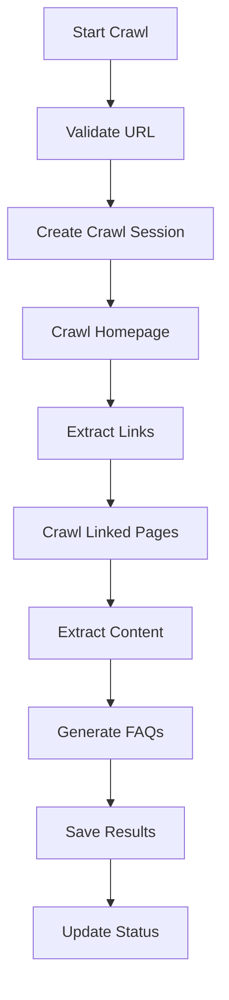

# Qurius AI - Website Crawler System

A comprehensive web crawling system that automatically extracts content from company websites and generates FAQs for the Qurius AI chat widget.

## 🚀 Features

### **Core Functionality**
- ✅ **Intelligent Crawling**: Crawls up to 50 pages per website with configurable depth
- ✅ **Content Extraction**: Extracts text from main content, paragraphs, and headings
- ✅ **FAQ Generation**: Automatically generates FAQs from crawled content
- ✅ **AI Integration**: Uses AI to create additional relevant FAQs
- ✅ **Respectful Crawling**: Includes delays and respects robots.txt
- ✅ **Real-time Monitoring**: Live status updates and progress tracking

### **Technical Features**
- ✅ **Database Integration**: Stores crawl sessions and generated FAQs
- ✅ **Error Handling**: Comprehensive error handling and recovery
- ✅ **Rate Limiting**: Configurable delays between requests
- ✅ **Content Filtering**: Removes scripts, styles, and navigation elements
- ✅ **Duplicate Detection**: Prevents duplicate FAQs and content

## 📁 File Structure

```
server/crawler/
├── crawler.js              # Main crawler class
├── crawler-api.js          # API endpoints
├── crawler-schema.sql      # Database schema
└── README.md              # This file

client/src/components/admin/
└── CrawlerInterface.tsx   # Frontend interface
```

## 🛠️ Installation

### **1. Install Dependencies**

```bash
cd server
npm install axios cheerio @supabase/supabase-js dotenv
```

### **2. Database Setup**

Run the SQL schema in your Supabase database:

```sql
-- Run the contents of crawler-schema.sql
```

### **3. Environment Variables**

Add to your `.env` file:

```env
# Existing variables
SUPABASE_URL=your_supabase_url
SUPABASE_SERVICE_ROLE_KEY=your_service_role_key
BACKEND_URL=http://localhost:3001

# New variables for AI integration
AI_SERVICE_URL=your_ai_service_url
AI_SERVICE_KEY=your_ai_service_key
```

### **4. Server Integration**

Add the crawler routes to your main server:

```javascript
// In server.js
const crawlerRoutes = require('./crawler/crawler-api')
app.use('/api/crawler', crawlerRoutes)
```

## 🎯 Usage

### **API Endpoints**

#### **Start Crawl**
```http
POST /api/crawler/start
Content-Type: application/json

{
  "companyId": "uuid",
  "websiteUrl": "https://example.com"
}
```

#### **Get Crawl Status**
```http
GET /api/crawler/status/:companyId
```

#### **Get Crawled FAQs**
```http
GET /api/crawler/faqs/:companyId
```

#### **Generate FAQs with AI**
```http
POST /api/crawler/generate-faqs
Content-Type: application/json

{
  "companyName": "Company Name",
  "content": "Website content...",
  "maxFAQs": 10
}
```

### **Frontend Integration**

Add the crawler interface to your admin pages:

```tsx
import { CrawlerInterface } from '@/components/admin/CrawlerInterface'

// In your admin component
<CrawlerInterface 
  companyId={company.id} 
  companyName={company.name} 
/>
```

## 🔧 Configuration

### **Crawler Settings**

Modify in `crawler.js`:

```javascript
class QuriusCrawler {
  constructor() {
    this.maxPages = 50        // Maximum pages to crawl
    this.maxDepth = 3         // Maximum crawl depth
    this.delay = 1000         // Delay between requests (ms)
    this.userAgent = 'Qurius-AI-Crawler/1.0'
  }
}
```

### **Content Extraction**

The crawler extracts content from:

- **Main Content**: `<main>`, `<article>`, `.content`, `.main`
- **Paragraphs**: All `<p>` tags with significant text
- **Headings**: All `<h1>` through `<h6>` tags
- **Metadata**: Page title and description

### **FAQ Generation**

FAQs are generated through:

1. **Pattern Matching**: Looks for question-answer patterns
2. **AI Generation**: Uses AI to create additional FAQs
3. **Quality Filtering**: Removes duplicates and low-quality content
4. **Confidence Scoring**: Assigns confidence scores to FAQs

## 📊 Database Schema

### **Tables**

#### **crawl_sessions**
- `id`: UUID primary key
- `company_id`: References companies table
- `base_url`: Website URL being crawled
- `pages_crawled`: Number of pages processed
- `content_extracted`: Number of content pieces extracted
- `faqs_generated`: Number of FAQs created
- `status`: 'running', 'completed', 'failed'
- `crawl_date`: When crawl started
- `completed_date`: When crawl finished


#### **Enhanced FAQs Table**
- Added `source`: 'manual', 'crawler', 'ai_generated'
- Added `confidence`: Confidence score (0.0-1.0)
- Added `crawl_session_id`: References crawl session

## 🔍 How It Works

### **1. Crawl Process**



### **2. Content Extraction**

1. **Fetch Page**: HTTP request with proper headers
2. **Parse HTML**: Use Cheerio for DOM manipulation
3. **Remove Noise**: Remove scripts, styles, navigation
4. **Extract Text**: Get text from content areas
5. **Filter Quality**: Only keep significant content

### **3. FAQ Generation**

1. **Pattern Detection**: Find question-answer patterns
2. **AI Processing**: Send content to AI service
3. **Parsing**: Extract Q&A pairs from AI response
4. **Deduplication**: Remove duplicate FAQs
5. **Quality Filter**: Keep only high-confidence FAQs

## 🚨 Best Practices

### **Respectful Crawling**
- ✅ **Delays**: 1-second delay between requests
- ✅ **User Agent**: Clear identification as Qurius AI crawler
- ✅ **Rate Limiting**: Configurable request limits
- ✅ **Error Handling**: Graceful failure handling

### **Content Quality**
- ✅ **Filtering**: Remove navigation and boilerplate
- ✅ **Length Checks**: Only significant content
- ✅ **Source Tracking**: Track where content came from
- ✅ **Confidence Scoring**: Rate FAQ quality

### **Performance**
- ✅ **Async Processing**: Non-blocking crawl operations
- ✅ **Database Indexing**: Optimized queries
- ✅ **Memory Management**: Clean up after processing
- ✅ **Timeout Handling**: Prevent hanging requests

## 🔧 Troubleshooting

### **Common Issues**

#### **1. Crawl Fails to Start**
```bash
# Check environment variables
echo $SUPABASE_URL
echo $SUPABASE_SERVICE_ROLE_KEY

# Check database connection
node -e "require('@supabase/supabase-js')"
```

#### **2. No FAQs Generated**
- Check if website has crawlable content
- Verify AI service is working
- Check crawl session status

#### **3. Slow Performance**
- Reduce `maxPages` and `maxDepth`
- Increase `delay` between requests
- Check network connectivity

### **Debug Mode**

Enable debug logging:

```javascript
// In crawler.js
console.log('🔍 Debug:', {
  url,
  contentLength: content.length,
  faqsFound: faqs.length
})
```

## 📈 Monitoring

### **Crawl Statistics**

Use the database function to get statistics:

```sql
SELECT * FROM get_crawl_statistics('company-uuid');
```

### **Real-time Monitoring**

The frontend interface provides:
- ✅ **Live Status**: Real-time crawl progress
- ✅ **Session History**: Previous crawl results
- ✅ **FAQ Preview**: Generated FAQs with confidence scores
- ✅ **Error Reporting**: Detailed error messages

## 🔮 Future Enhancements

### **Planned Features**
- 🔄 **Scheduled Crawls**: Automatic periodic crawling
- 🔄 **Content Analysis**: Advanced content categorization
- 🔄 **SEO Integration**: Extract meta tags and keywords
- 🔄 **Image Processing**: Extract and analyze images
- 🔄 **PDF Support**: Crawl and extract PDF content

### **Advanced AI Features**
- 🔄 **Semantic Analysis**: Better content understanding
- 🔄 **Topic Modeling**: Automatic topic extraction
- 🔄 **Sentiment Analysis**: Content sentiment scoring
- 🔄 **Language Detection**: Multi-language support

## 📞 Support

For issues or questions:
1. Check the console logs for error messages
2. Verify database schema is properly installed
3. Test with a simple website first
4. Check network connectivity and firewall settings

The crawler system is designed to be robust and self-healing, but always test with a small website before crawling large sites. 